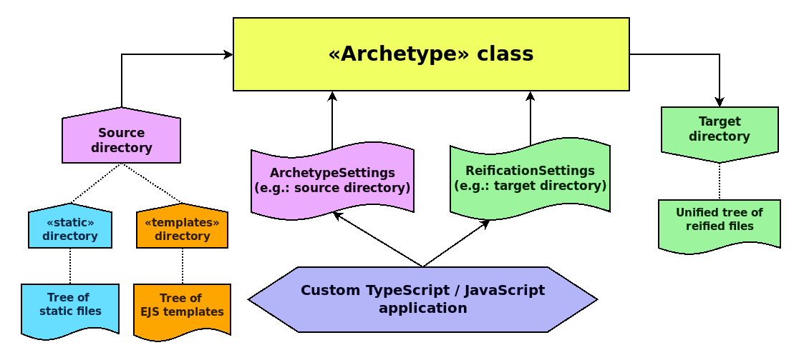

# Platonic

_General-purpose archetype directory reification_


[](https://badge.fury.io/js/@giancosta86%2Fplatonic)
[](/LICENSE)



**Platonic** is a TypeScript library focused on _general-purpose template reification_ applied to a directory tree.

More precisely, it _recursively_ copies all the files from a **source directory** to a **target directory** - _creating the latter_ if it doesn't already exist and _never deleting (at most replacing_) its files.
Furthermore, it applies _selective metadata injection_ via [EJS](https://www.npmjs.com/package/ejs)-based _templating_.

The _source directory_ can contain _one or both_ of the following subdirectories:

- `static`: directory tree that will be copied _unaltered_ to the _target directory_

- `templates`: directory tree that will be processed using the **EJS** template engine, injecting an arbitrary metadata object into each file

Such minimalism makes Platonic especially useful in the context of tools like npm/Yarn project generators and bulk file management apps, whenever _expressive templating_ is required.

## Installation

```bash
npm install @giancosta86/platonic
```

or

```bash
yarn add @giancosta86/platonic
```

The public API entirely resides in the root package index, so one shouldn't reference specific modules.

## Usage

Platonic provides the `Archetype` class, which includes:

- the constructor, whose input is an `ArchetypeSettings` object: in practice, its `sourceDirectory` field contains the path to the **source directory** - which, in turn, _must_ contain one or more of the `static` and `templates` subdirectories, as described above

- the `reify()` method takes a `ReificationSettings<TMetadata>` object, with the following fields:

  - `targetDirectory`: the directory that will receive both the _static files_ and the _reified templates_. Additionally:

    - if it doesn't already exist, _it will be created_

    - if it already contains files, _they won't be deleted_ - but they could be _overwritten_

  - `metadata`: arbitrary object - compatible with the `Data` interface required by EJS - used to inject metadata into every file below the `templates` subdirectory of the source directory. It is _optional_ - especially when just using the `static` directory tree and no templates

  - `encoding`: the _source encoding_ for template files - and the related output files, too. Optional: `utf8` is the default value

  The method returns a `Promise<void>` that represents the reification process itself.

In practice, you just need to create an `Archetype` instance and then call its `reify()` method as soon as you need it and as many times as you need it - always waiting for the resolution of the returned `Promise`.

```typescript
//You can initialize the Archetype anywhere...
const archetype = new Archetype({
  sourceDirectory: "..."
});

//...and you can call reify() whenever you need it!
await archetype.reify({
  targetDirectory: "...",
  metadata: {
    name: "Yogi",
    age: 36
  },
  encoding: "utf8"
});
```

## Further references

- [create-marp-slides](https://github.com/giancosta86/create-marp-slides) - dedicated to the creation of Marp-based projects with _detached Sass stylesheets_ and _dedicated lifecycle scripts_. It represents the very starting point of Platonic.
